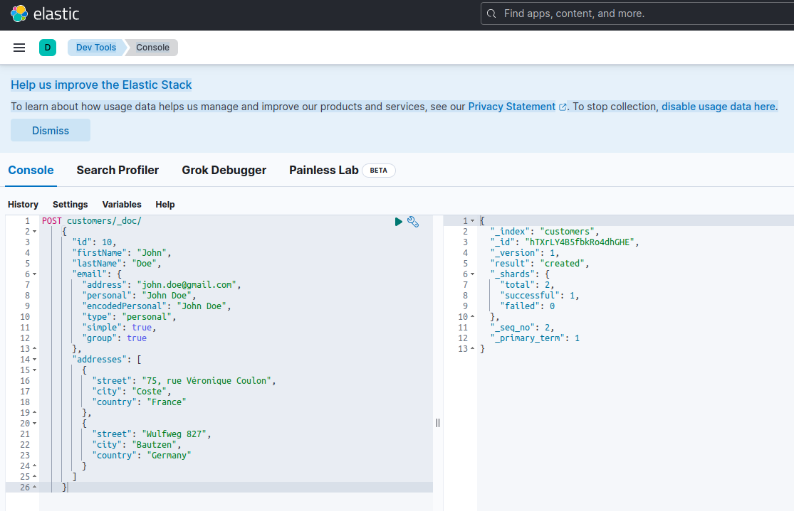

# CRUDing NoSQL Data with Quarkus: Part Two - Elasticsearch
In the [1st part](https://dzone.com/articles/cruding-nosql-data-with-quarkus-part-one-mongodb) of this short series, we 
have looked at MongoDB, one of the most reliable and robust document oriented NoSQL database. In this 2nd part we'll 
examine another quite unavoidable NoSQL database: Elasticsearch.

More than just a popular and powerful open source distributed NoSQL database, Elasticsearch is, first of all, a search 
and analytics engine. It is built on the top of Apache Lucene, the most famous search engine Java library, and is able 
to perform real-time search and analysis operations on structured and unstructured data. It is designed to handle 
efficiently large amount of data.

Once again, we need to disclaim that this short post is by no means an Elasticsearch tutorial and, accordingly,the 
inpatient reader is strongly advised to extensively use the official documentation, as well as the excellent book 
"Elasticsearch in Action" by Madhusudhan Konda (Manning 2023), in order to learn more about the product's architecture
and operations. Here we're just reimplement the same use case as previously, but using this time Elasticsearch insted of 
MongoDB.

So, here we go !

## The Domain Model
The diagram below shows our *customer-order-product* domain model:

This diagram is the same as the one presented in the 1st part. Like MongoDB, Elasticsearch is also a document data store 
and, as such, it expects documents to be presented in JSON notation. The only difference being the fact that, in order to
handle its data, Elasticsearch needs to get them indexed. There are several ways that data can be indexed into an Elasticsearch
data store, for example piping them from a relational database, extracting them from a filesystem, streaming them from
a real-time source, etc. But whatever the ingestion method might be, it eventually consists in invoking the Elasticsearch
RESTful API via a dedicated client. There are two categories of such dedicated clients:
  - REST-based clients like `cUrl`, `Postman`, HTTP modules for Java, JavaScript, NodeJS, etc.
  - Progtramming language SDKs (*Software Development Kit*). Elasticsearch provides SDKs for all the most used programming languages, including but not limited to Java, Python, etc.

Indexing a new document with Elasticsearch means creating it using a POST request against a special RESTful API endpoint
named `_doc`. For example, the following request will create a new Elasticsearch index and store a new customer instance
in it.

    POST customers/_doc/
    {
      "id": 10,
      "firstName": "John",
      "lastName": "Doe",
      "email": {
        "address": "john.doe@gmail.com",
        "personal": "John Doe",
        "encodedPersonal": "John Doe",
        "type": "personal",
        "simple": true,
        "group": true
      },
      "addresses": [
        {
          "street": "75, rue Véronique Coulon",
          "city": "Coste",
          "country": "France"
        },
        {
          "street": "Wulfweg 827",
          "city": "Bautzen",
          "country": "Germany"
        }
      ]
    }

Running the request above, using `curl` or the Kibana console, as we'll see later, will produce the following result:

    {
      "_index": "customers",
      "_id": "ZEQsJI4BbwDzNcFB0ubC",
      "_version": 1,
      "result": "created",
      "_shards": {
        "total": 2,
        "successful": 1,
        "failed": 0
      },
      "_seq_no": 1,
      "_primary_term": 1
    }

This is the Elasticsearch standard response to a `POST` request. It confirms having created the index named `customers`,
having a new `customer` document, identified by an automatically generated ID, in this case  `ZEQsJI4BbwDzNcFB0ubC`. Other
interesting parameters appear here, like `_version` and, especially `_shards`. Without going too much in details here,
Elasticsearch creates indexes a logical collections of documents. Just like keeping paper documents in a filling cabinet, 
Elasticsearch keeps documents in an index. Each index is composed of *shards* which are physical instances of Apache 
Lucene, the engine behind the scene responsible for getting the data in or out the storage. They might be either *primary*,
storing documents, or *replicas* storing, as the name suggests, copies of primary shards. More on that in the Elasticsearch
documentation, for know we need to notice that our index, named `customers` is composed of two shards, which one, of 
course, primary.

A final notice: the `POST` request above doesn't mention the ID value as it is automatically generated. While this is
probably the most common use case, we could have provided our own ID value, in each case the HTTP request to be used isn't 
`POST` anymore, but `PUT`.

To come back on our domain model diagram, as you can see, its central document is `Order`, stored in a dedicated 
collection named `Orders`. An `Order`is an aggregate of `OrderItem` documents, each of which points to its associated 
`Product`. An `Order` document references also the `Customer` who placed it. In Java, this is implemented as follows:

    public class Customer
    {
      private Long id;
      private String firstName, lastName;
      private InternetAddress email;
      private Set<Address> addresses;
      ...
    }

The code above is showing a fragment of the `Customer` class. This is a simple POJO (*Plain Old Java Object*) having
properties like the customer's ID, first and last name, the email address and a set of postal addresses.

Let's look now at the `Order` document.

    public class Order
    {
      private Long id;
      private String customerId;
      private Address shippingAddress;
      private Address billingAddress;
      private Set<String> orderItemSet = new HashSet<>()
      ...
    }

Here you can notice some differences compared to the MongoDB version. As a matter of fact, with MongoDB we were using a
reference to the customer instance associated to this order. This notion of reference doesn't exist with Elasticsearch 
and, hence, we're using this document ID in order to to create an association between the order and the customer who 
placed it. The same applies to the `orderItemSet` property which creates association between the order and its items.

The rest of our domain model is quite similar and based on the same normalization ideas. For example, the `OrderItem`
document:

    public class OrderItem
    {
      private String id;
      private String productId;
      private BigDecimal price;
      private int amount;
      ...
    }

Here, we need to associate the product which makes the object of the current order item. Last but not least, we have the
`Product` document:

    public class Product
    {
      private String id;
      private String name, description;
      private BigDecimal price;
      private Map<String, String> attributes = new HashMap<>();
      ...
    }

## The Data Repositories
Quarkus Panache greatly simplifies the data persistence process by supporting both the *active record* and the *repository*
design patterns (https://www.martinfowler.com/eaaCatalog/activeRecord.html). In our Part One we used the Quarkus Panache
extension for MongoDB to implement our data repositories but there is not yet an equivalent Quarkus Panache extension for
ElasticsearchHere. Accordingly, waiting for a possible future Quarkus extension for Elasticsearch, here we have to manually
implement our data repositories using the Elasticsearch dedicated client.

Elasticsearch is written in Java and, consequently, there is not a surprise that it offers a native support for invoking
the Elasticsearch API using the Java client library. This library is based on *fluent API builder* design patterns and 
provides both synchronous and asynchronous processing models. It requires Java 8 at minimum.

So, what our *fluent API builder* based data repositories look like ? Here below is an excerpt of the `CustomerServiceImpl`
class which acts as a data repository for the `Customer` document. 

    @ApplicationScoped
    public class CustomerServiceImpl implements CustomerService
    {
      private static final String INDEX = "customers";

      @Inject
      ElasticsearchClient client;

      @Override
      public String doIndex(Customer customer) throws IOException
      {
        return client.index(IndexRequest.of(ir -> ir.index(INDEX).document(customer))).id();
      }
      ...

As we can see, our data repository implemnation must be a CDI bean having an application scope. The Elasticsearch Java client
is simply injected, thanks to the `quarkus-elasticsearch-java-client` Quarkus extension, avoiding this way lots of bells and
whistles that we would have had to use otherwise. The only thing we need in order to be able to inject the client is to 
declare the following property:

    quarkus.elasticsearch.hosts = elasticsearch:9200

Here `elasticsearch` is the DNS (*Domain Name Server*) name that we associate to the Elastic search databse server in the
`docker-compose.yaml` file and `9200` is the TCP port number used by the server to listen for connections.

The method `doIndex()` above is creating a new index, named `customers`, if it doesn't exist and indexes (stores) into it a
new document representing an instance of the class `Customer`. The indexing process is performed based on an `IndexRequest`
accepting as input arguments the index name and the document body. As for the document ID, it is automatically generated and
returned to the caller for further references.

The following method allows to retrieve the customer identified by the ID given as an input argument:

      @Override
      public Customer getCustomer(String id) throws IOException
      {
        GetResponse<Customer> getResponse = client.get(GetRequest.of(gr -> gr.index(INDEX).id(id)), Customer.class);
        return getResponse.found() ? getResponse.source() : null;
       }

The principle is the same: using this *fluent API builder* pattern we construct a `GetRequest` instance, in a similar way 
that we did with the `IndexRequest` and we run it against the Elasticsearch Java client. The other endpoints of our data
repository, allowing to perform full search operations or to update and delete customers, are designed exactly the same way.
Please take some time to look at the code in order to understand how things are working.

## The REST API
Our MongoDB REST API interface was simple to implement, thanks to the `quarkus-mongodb-rest-data-panache` Quarkus extension, 
which annotation processor has automatically generated all the required endpoints. With Elasticsearch, we don't 
beneficiate yet of the same confort and, hence, we need to manually implement it. That's not a big deal, as far as we
can inject the previous data repositories, as shown below:

    @Path("customers")
    @Produces(APPLICATION_JSON)
    @Consumes(APPLICATION_JSON)
    public class CustomerResourceImpl implements CustomerResource
    {
      @Inject
      CustomerService customerService;

      @Override
      public Response createCustomer(Customer customer, @Context UriInfo uriInfo) throws IOException
      {
        return Response.accepted(customerService.doIndex(customer)).build();
      }

      @Override
      public Response findCustomerById(String id) throws IOException
      {
        return Response.ok().entity(customerService.getCustomer(id)).build();
      }

      @Override
      public Response updateCustomer(Customer customer) throws IOException
      {
        customerService.modifyCustomer(customer);
        return Response.noContent().build();
      }

      @Override
      public Response deleteCustomerById(String id) throws IOException
      {
        customerService.removeCustomerById(id);
        return Response.noContent().build();
      }
    }

This is the customers REST API implementation, the other ones associated to orders, order items and products, are similar.

Let's see now how to run and test the whole stuff.

## Running and testing our microservices
Now that we looked at the details of our implementation, let's see how to run and test it. We chose to do it on the behalf of the `docker-compose`
utility. Here is the associated `docker-compose.yml` file:

    version: "3.7"
    services:
      elasticsearch:
        image: elasticsearch:8.12.2
        environment:
          node.name: node1
          cluster.name: elasticsearch
          discovery.type: single-node
          bootstrap.memory_lock: "true"
          xpack.security.enabled: "false"
          path.repo: /usr/share/elasticsearch/backups
          ES_JAVA_OPTS: -Xms512m -Xmx512m
        hostname: elasticsearch
        container_name: elasticsearch
        ports:
          - "9200:9200"
          - "9300:9300"
        ulimits:
        memlock:
          soft: -1
          hard: -1
        volumes:
          - node1-data:/usr/share/elasticsearch/data
        networks:
          - elasticsearch
      kibana:
        image: docker.elastic.co/kibana/kibana:8.6.2
        hostname: kibana
        container_name: kibana
        environment:
          - elasticsearch.url=http://elasticsearch:9200
          - csp.strict=false
        ulimits:
          memlock:
            soft: -1
            hard: -1
        ports:
          - 5601:5601
        networks:
          - elasticsearch
        depends_on:
          - elasticsearch
        links:
          - elasticsearch:elasticsearch
      docstore:
        image: quarkus-nosql-tests/docstore-elasticsearch:1.0-SNAPSHOT
        depends_on:
          - elasticsearch
          - kibana
        hostname: docstore
        container_name: docstore
        links:
          - elasticsearch:elasticsearch
          - kibana:kibana
        ports:
          - "8080:8080"
           - "5005:5005"
        networks:
          - elasticsearch
        environment:
          JAVA_DEBUG: "true"
          JAVA_APP_DIR: /home/jboss
          JAVA_APP_JAR: quarkus-run.jar
    volumes:
      node1-data:
      driver: local
    networks:
      elasticsearch:

This file instructs the `docker-compose` utility to run three services:
  - a service named `elasticsearch` running the Elasticsearch 8.6.2 database;
  - a service named `kibana` running the Kibana, the multipurpose web console providing different options such as exexcuting queries, creating aggregations and developing dashboards and graphs;
  - a service named `docstore` running our Quarkus microservice.

Now, you may check that all the required processes are running:

    $ docker ps
    CONTAINER ID   IMAGE                                                     COMMAND                  CREATED      STATUS      PORTS                                                                                            NAMES
    005ab8ebf6c0   quarkus-nosql-tests/docstore-elasticsearch:1.0-SNAPSHOT   "/opt/jboss/containe…"   3 days ago   Up 3 days   0.0.0.0:5005->5005/tcp, :::5005->5005/tcp, 0.0.0.0:8080->8080/tcp, :::8080->8080/tcp, 8443/tcp   docstore
    9678c0a04307   docker.elastic.co/kibana/kibana:8.6.2                     "/bin/tini -- /usr/l…"   3 days ago   Up 3 days   0.0.0.0:5601->5601/tcp, :::5601->5601/tcp                                                        kibana
    805eba38ff6c   elasticsearch:8.12.2                                      "/bin/tini -- /usr/l…"   3 days ago   Up 3 days   0.0.0.0:9200->9200/tcp, :::9200->9200/tcp, 0.0.0.0:9300->9300/tcp, :::9300->9300/tcp             elasticsearch
    $

And in order to confirm that the Elasticsearch server is available and able to run quesries, you can connect to Kibana, 
at http://localhost:601 and, after scrolling down the page and selecting `Dev Tools` in the preferences menu, you can run
queries as shown below:

In order to test the microservices, proceed as follows:

  1. Clone the associated GitHub repository:
      
    $ git clone https://github.com/nicolasduminil/docstore.git

  2. Go to the project:

    $ cd docstore

  3. Checkout the right branch:

    $ git checkout elastic-search

  4. Build

    $ mvn clean install

  5. Run the integration tests

    $ mvn -DskipTests=false failsafe:integration-test

This last command will run the 17 provided integration tests which should all succeed. You can also use the Swagger UI interface for testing
purposes by fireing your prefered browser at http://localhost:8080/q:swagger-ui. Then, in order to test endpoints, you can use the
payload in the JSON files located in the `src/resources/data` directory of the `docstore-api` project.

Enjoy !